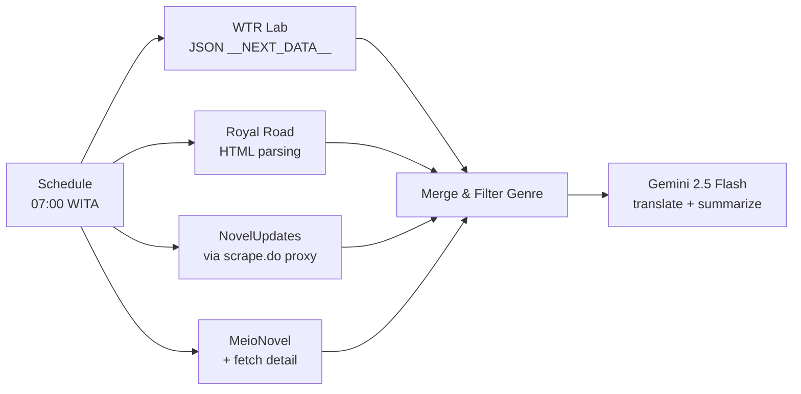
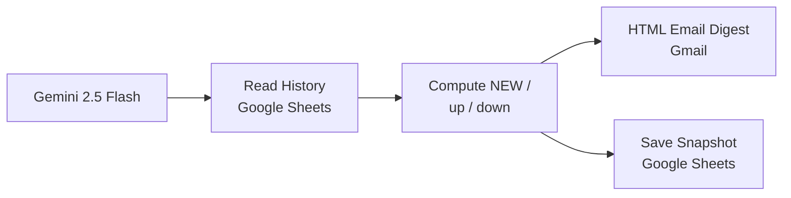

# Daily Novel Recommendations

An automated email digest with the daily top 10 novel rankings from four different sites, delivered every morning. Built on n8n.

**Status:** Production (personal use). Runs automatically every day via n8n for my own needs,
with graceful degradation when one of the sources fails.

---

## Table of Contents

- [Problem](#problem)
- [Solution](#solution)
- [Result](#result)
- [How it works](#how-it-works)
- [Known limitations](#known-limitations)
- [Running it yourself](#running-it-yourself)
- [Tech Stack](#tech-stack)
- [License](#license)

---

## Problem

I read web novels every day, and every morning I'd repeat the same ritual: open each ranking
site one by one, compare what moved up, guess what's worth reading. Repetitive, time-consuming,
and worst of all, I'd often read the exact same list as yesterday without noticing, since
rankings rarely change drastically.

Three problems I wanted to solve:

1. **Repetitive.** Four sites opened manually every day.
2. **No memory.** No way to tell what's genuinely a new title versus what's been sitting at
   the top for a week.
3. **Language and genre.** Most sites are in English, and there are genres I always filter
   out but had to do manually on every site.

---

## Solution

A single scheduled n8n workflow that fetches, filters, compares, translates, and then sends
the result.

### Technical decisions

**Researched sources before writing a single line of code.** I probed eleven sites first to
map out what was reachable before deciding on the architecture. The results changed the
original plan significantly.

| Site | Status | Decision |
|---|---|---|
| wtr-lab.com | Directly reachable | Used, structured JSON data in `__NEXT_DATA__` |
| royalroad.com | Directly reachable | Used, clean and consistent HTML |
| novelupdates.com | Cloudflare 403 | Used via proxy, richest genre data, worth the cost |
| meionovel.id | Directly reachable | Used, content is already in Indonesian |
| webnovel.com | Cloudflare 403 | Dropped, see Known limitations |
| scribblehub, ranobes, lightnovelworld, novelfull, sakuranovel, novelgo | 403 / dead | Not used |

**Chose a source that already solved the problem, rather than adding a layer to fix a worse
one.** meionovel.id serves titles, genres, and synopses already in Indonesian. For this
source there's no translation step at all, which is both more accurate and cheaper than
translating English results.

**Filters on English tags, displays in Indonesian.** Genre filtering runs against each
site's original tag names (`Harem`, `Yaoi`, `Shounen Ai`) because that matching is reliable.
What readers see is translated through a fixed dictionary, not a machine translator, so
genre names are never wrong.

**Fetches more than needed.** Genre filtering discards roughly 40 to 57% of candidates, so
each source pulls 2 to 3 times its target count. The final result still lands on exactly ten,
not whatever happens to survive.

**Graceful degradation, not total failure.** Every source and LLM call is set to
`continueRegularOutput`. If the proxy runs out of quota or Gemini goes down, the email still
sends with whichever sources succeeded, plus a warning box naming which source failed to
load that day.

---

## Result

Runs automatically every morning at 07:00 WITA. A single execution takes about 67 seconds.

**40 titles per day**: ten from each of the four sources, already genre-filtered.

Email contents:

- **Today's Pick**: the single highest-rated title among newcomers
- **NEW badge** for titles that have never appeared in the top 10 before
- **▲ / ▼** rank change versus the previous day
- **"day N"** for titles that have stuck around for a while, so it's clear which ones are
  just passing through
- **Genre chips** in Indonesian
- **Synopsis**, 2 to 3 sentences in Indonesian, summarized by Gemini
- Rating, chapter count, reader count, and direct links

The "same list every day" problem is measurably solved, verified across two consecutive
runs: the first run flagged all 20 titles as NEW, the second flagged 0 as new, with all of
them now showing "day 2".

Genre filtering is also proven to actually work, not just be wired up. NovelUpdates' #1
ranked title during testing was a Harem-genre title; it was removed from the results,
replaced by the next title. On MeioNovel, 8 of 14 candidates were filtered out.

**Operating cost: zero.** Everything runs on free-tier quota:

| Service | Quota | Usage |
|---|---|---|
| scrape.do | 1,000 credits/month | ~300 |
| Gemini 2.5 Flash | free tier | 1 batch call/day |
| Google Sheets & Gmail | none | within normal limits |

---

## How it works

### History and comparison

Google Sheets stores one row per novel per day: `run_date, source, rank, key, title, url, rating, views, chapters, genres`.

Every time it runs, the workflow reads the full history, finds the most recent date before
today, and compares rankings. The `key` column (`source|id`) keeps matching accurate even if
a title's text changes.

Timezone matters here: `run_date` is computed against `Asia/Makassar`. A wrong timezone would
cause an early-morning run to be logged under yesterday's date and break the NEW calculation.

### Translation

Every synopsis is sent in a single batch call to Gemini, not one call per novel. The
instructions are strict: 2 to 3 complete sentences, never stop mid-sentence, never use an
ellipsis, and preserve genre-specific terms like *cultivation*, *xianxia*, *LitRPG*.

### Error handling

A separate `Error Handler - Universal` workflow is wired in as the error workflow. On any
failure, it emails the workflow name, the failed node, the error message, and a direct link
to the execution page, so there's no need to open n8n to know something broke.

---

## Known limitations

**WTR Lab's genre filter isn't fully precise.** The site stores genres as numeric IDs and
doesn't publish an ID-to-name map anywhere; I traced it through the novel page, novel-finder,
sitemap, alternate locales, and 47 of its JS files. Filtering for this source runs on *tags*
instead (Reverse Harem, Slave Harem, Shounen-Ai Subplot, and similar). A novel labeled only
with the broad genre "Harem" and no related tag can still slip through.

**Webnovel was dropped, not left broken.** Its ranking page only exposes one broad category
(`Urban`, `Fantasy`), with no detailed genre and no synopsis. Real filtering would require
fetching every book's page through a paid proxy, roughly 3,000 credits/month against a free
quota of 1,000. Not worth it.

**NovelUpdates synopses aren't available** on the ranking page, and showing them would need
an extra proxy request per novel.

**Three of 40 entries still show mojibake** (`Count’s` instead of `Count's`) in titles from
a specific source. Three fix attempts have failed; the root cause hasn't been found yet. The
impact is cosmetic: titles are still readable and links still work.

---

## Running it yourself

Prerequisites: an n8n instance, a Google account, and two free API keys.

1. Create a history spreadsheet with the header:
   `run_date, source, rank, key, title, url, rating, views, chapters, genres`
2. Set up n8n credentials: Gmail (OAuth2), Google Sheets (OAuth2), and two **Query Auth**
   credentials:

   | Credential | Parameter name | Source |
   |---|---|---|
   | Scrape.do | `token` | [scrape.do](https://scrape.do), 1,000 free credits/month |
   | Gemini | `key` | [Google AI Studio](https://aistudio.google.com/apikey) |

3. Import [`novel-digest.sanitized.json`](novel-digest.sanitized.json) via **Workflows -> Import from File**
4. Find `GANTI_` inside the workflow and replace with your own values
5. Set the workflow timezone, n8n defaults to UTC
6. Publish, then attach an error workflow

API keys are never stored inside a node. Everything goes through n8n's credential system, so
they don't get exported with the workflow. The `novel-digest.sanitized.json` file in this
repo has already been scrubbed of spreadsheet IDs, credential IDs, and email addresses.

---

## Tech Stack

n8n, Google Gemini 2.5 Flash, Google Sheets, Gmail API, scrape.do

## License

[MIT](LICENSE), © 2026 Agung Tri Mahmudi

## 👤 Author

**Agung Tri Mahmudi**

- Email: agungtrimahmudi.it@gmail.com
- GitHub: [github.com/Agungtrimahmudi-automation](https://github.com/Agungtrimahmudi-automation)
- LinkedIn: [linkedin.com/in/agung-tri-mahmudi](https://linkedin.com/in/agung-tri-mahmudi)
